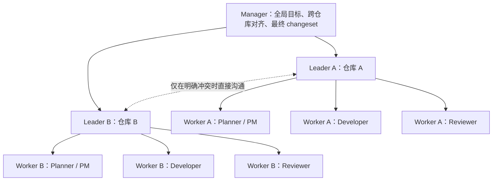

# Cross-Repo Team Delivery

`cross-repo-team-delivery` 是一个面向 Codex 的多仓库协作 Skill。它把一个 Codex 任务作为 `manager`，为每个仓库建立一个 `leader`，再由各仓库的 leader 管理有顺序的 worker 团队，完成规划、开发、审查、跨仓库对齐、提交和 changeset 汇总。

它适合以下场景：

- 同一个需求需要修改多个本地 Git 仓库；
- 希望按照 PM / Developer / Reviewer 或自定义角色交付；
- 希望每个仓库保留计划、决策、开发、审查和交接记录；
- 希望审查通过后再提交，并由 manager 生成统一 changeset JSON；
- 希望后续恢复未完成的运行，或复用配置兼容的 Codex 任务。

## 团队结构



仓库之间可以并行推进。同一个仓库内的普通角色按配置顺序执行，避免多个 writer 同时修改同一工作区。审查角色只在 review gate 运行，不作为普通开发阶段重复执行。

## 主要能力

- 一次只确认一个参数，最终确认前不创建任务、不写文件；
- 支持任意正整数数量的仓库；
- 支持标准三角色、精简双角色或自定义角色和职责；
- worker 可以进行必要的同级沟通，但关键结论必须记录并向 leader 汇报；
- leader 之间通过 manager 聚合对齐，只有明确冲突才直接讨论；
- 审查结果使用 `APPROVED` 或 `CHANGES_REQUESTED`；
- 只重新运行受审查意见影响的角色，并限制最大审查轮数；
- 按仓库保存完整的审计记录；
- 每个仓库生成一个有意图的本地提交；
- manager 验证所有提交后生成统一 changeset JSON；
- 可根据仓库、角色和配置哈希复用兼容的 Codex 任务。

## 前置条件

- Codex 桌面应用、Codex CLI 或 IDE 扩展；
- Git；
- Python 3；
- 待关联目录必须是准确的 Git 仓库根目录；
- Codex 必须能够访问仓库并使用任务管理能力。

Codex 官方说明中，Skill 是包含 `SKILL.md` 以及可选脚本和参考资料的目录；放在 `~/.codex/skills` 下的个人 Skill 可以跨仓库使用。参见 [OpenAI 官方 Skill 文档](https://learn.chatgpt.com/docs/build-skills)。

## 安装

仓库当前为私有仓库，因此需要先登录有访问权限的 GitHub 账号。

### Windows PowerShell

```powershell
gh auth login

$skillsRoot = Join-Path $env:USERPROFILE '.codex\skills'
New-Item -ItemType Directory -Force -Path $skillsRoot
gh repo clone catbobyman/cross-repo-team-delivery (Join-Path $skillsRoot 'cross-repo-team-delivery')
```

如果已经安装，只需更新：

```powershell
$skillPath = Join-Path $env:USERPROFILE '.codex\skills\cross-repo-team-delivery'
git -C $skillPath pull --ff-only
```

### macOS / Linux

```bash
mkdir -p ~/.codex/skills
gh repo clone catbobyman/cross-repo-team-delivery ~/.codex/skills/cross-repo-team-delivery
```

安装或更新后，建议打开一个新的 Codex 任务，让 Skill 列表重新加载。

## 如何调用

推荐显式调用：

```text
Use $cross-repo-team-delivery，协调多个仓库完成用户认证升级。
```

Codex 也可以根据请求和 Skill 的 `description` 自动选择它。官方支持通过 `$skill-name` 显式提及 Skill，参见 [OpenAI 官方说明](https://learn.chatgpt.com/docs/build-skills#how-chatgpt-and-codex-use-skills)。

### 只创建团队

```text
Use $cross-repo-team-delivery，只搭建团队，不开始开发。
目标是验证 manager、leader、worker 的分层通信和汇报路径。
```

### 完整交付

```text
Use $cross-repo-team-delivery，完成跨仓库的视频任务调度功能。
需要关联后端仓库和 VideoAgent 仓库，开发完成、审查通过并对齐后分别提交，最后生成 changeset。
```

### 恢复未完成运行

```text
Use $cross-repo-team-delivery，恢复上次未完成的跨仓库交付。
```

不需要在第一条消息中填写完整 YAML。Skill 会逐项确认配置。

## 初始化时确认的参数

| 参数 | 说明 |
|---|---|
| 运行模式 | `bootstrap-only`、`full-delivery` 或 `resume` |
| 交付目标 | manager 和各团队共同遵循的目标 |
| 仓库数量 | 要关联的本地 Git 仓库数量 |
| 仓库信息 | 每个仓库的名称和绝对路径 |
| Worker 角色 | 有顺序的角色列表，可使用预设或自定义 |
| 角色职责 | 每个角色负责的工作和交付边界 |
| Review gate | 唯一可以给出审查结论的角色 |
| 最大审查轮数 | 超过限制后停止自动修改并上报 manager |
| 任务复用策略 | 复用配置兼容的现有任务，或始终创建新任务 |

有原生问题卡片能力时，回答后会自动显示下一张卡片，不需要额外输入“下一张”。无法使用原生卡片时，Skill 会在当前模式下降级为逐题文本交互，不强制切换 Plan mode。

完成全部参数后，Skill 会显示汇总并要求最终确认。只有确认后才会创建团队、写入记录或修改仓库。

## 交付流程

1. Manager 读取环境事实并逐项确认参数。
2. 每个仓库建立或复用一个 leader。
3. Leader 建立或复用所配置的 worker。
4. Leader 编写 `spec.md` 和 `plan.md`。
5. 普通 worker 按角色顺序执行并写入报告与 handoff。
6. Review-gate worker 独立检查代码、测试和记录。
7. 如果要求修改，只重新运行受影响角色，然后再次审查。
8. 所有仓库审查通过后，各 leader 向 manager 提交对齐输入。
9. Manager 给出统一对齐结论，各 leader 分别创建本地提交。
10. Manager 验证提交和工作区，生成 changeset JSON。

Skill 不会自动推送业务仓库提交；只有用户明确要求时才会 push。

## 运行记录

每个仓库会保存：

```text
agent-team/runs/<run-id>/
├── run-config.json
├── roster.json
├── spec.md
├── plan.md
├── decisions.jsonl
├── development-log.md
├── role-reports/
├── handoffs/
├── review.md
├── review.json
├── alignment-input.json
├── alignment.md
└── result.json
```

Manager 工作区会生成：

```text
changesets/<run-id>.json
```

changeset 会记录每个仓库的提交、变更文件、角色、审查轮次、配置哈希和记录目录，并验证仓库数量、工作区状态、审查结果与对齐状态。

## 仓库内容

| 路径 | 用途 |
|---|---|
| [`SKILL.md`](SKILL.md) | Skill 的核心执行指令 |
| [`agents/openai.yaml`](agents/openai.yaml) | Codex UI 元数据和默认提示词 |
| [`references/onboarding-cards.md`](references/onboarding-cards.md) | 初始化问答协议 |
| [`references/protocol.md`](references/protocol.md) | 团队层级、通信和状态机 |
| [`references/artifacts-and-changeset.md`](references/artifacts-and-changeset.md) | 运行产物和 changeset 规范 |
| [`scripts/init_run.py`](scripts/init_run.py) | 初始化或恢复仓库运行记录 |
| [`scripts/build_changeset.py`](scripts/build_changeset.py) | 验证提交并生成 manager changeset |

## 安全边界

- 最终确认前只允许只读发现；
- 不会隐式执行 `git init`；
- 不会覆盖无关的用户改动；
- 没有明确 `APPROVED` 就不会提交；
- 审查轮数耗尽时上报，不伪造通过；
- 跨仓库未完成对齐时不生成最终 changeset；
- 不会覆盖已有 changeset，除非用户明确授权。
